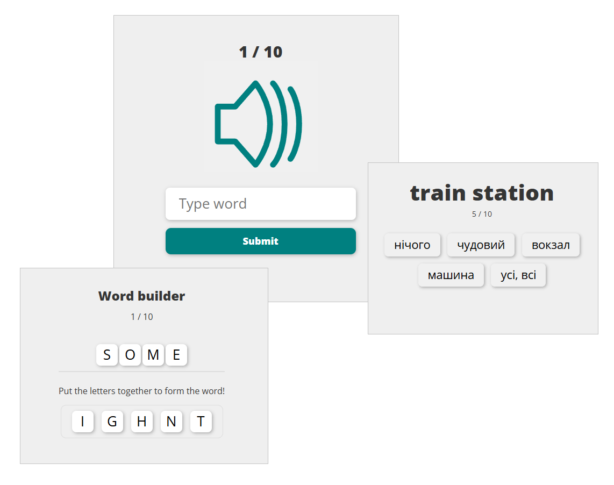

# 📚 Dictionary

📌 Screenshots of the app are shown at the end of this document.
If you want to try the app live, feel free to contact me and I’ll provide you with online access.

 **This app improves your English learning experience** — and not only English!  
This online dictionary helps you remember words faster and more effectively with interactive learning modes.

## ✨ Features
- 📚 Convenient interface for viewing all words and irregular verbs **✓**
- 🔊 Listen to word pronunciations **✓**
- 📖 See word translations by clicking on them (hidden by default) **✓**
- 🧠 Mark words as “learned” **✓**
- 📱 Responsive design for mobile use **✓**
- ✅ Authorization using JWT tokens with secure cookies **✓**
- 🔐 User registration and login functionality ✓  
- ⚙️ Very easy to set up (uses JSON as the database) **✓**


## 📅 Daily Learning Mode — **Learn 10**

Boost your vocabulary with **Learn 10** — a fun and effective daily routine that helps you master **10 new words every day**.

This mode combines translation, listening, spelling, and quick quizzes in a scientifically designed sequence that reinforces memory through repetition and task prioritization.

It includes the following game modes:

- 🎧 **Listen & Type** – type the word you hear.
- 🔁 **Translate Forward** – translate from your native language.
- 🔄 **Translate Backward** – choose the correct translation.
- 🔤 **Word Builder** – build the word from shuffled letters.
- ⚡ **Mini Sprint** – fast-paced word choice challenge.




## 🎮 Quick Quiz Mode

**Quick Quiz** is an interactive review mode that helps you reinforce vocabulary from your personal dictionary:

- ✅ If you enter the correct word, it will be marked as **learned**.
- ❌ If you click the **"I do not know"** button, the word will be marked as **unlearned**.
- 🔁 A random word is selected from your dictionary each time.

**GIF from the Old UI**


## 🛠 Technologies Used:
- React
- React Router
- Zustand
- SASS (SCSS)
- Vite
- NodeJS (Express)
- JSON as Database
- JWT
- nodemon
- npm & yarn


# Available Scripts:

### Client:
`npm run dev` or `yarn dev`
Runs the app in development mode.

Open [http://localhost:3000](http://localhost:3000) to view it in the browser.  
The page reloads on edits and shows lint errors in the console.

 `npm run build` or `yarn build`
Builds the app for production in the `build` folder.  
Optimized and minified with hashed filenames for deployment.

More info: [Vite Deployment Guide](https://vite.dev/guide/build)

### Server:
 `npm start` or `yarn start`
Starts the NodeJS Express server on port 3001 (default).

 `npm run dev` or `yarn dev`
Runs the server in development mode.

 `npm run build` or `yarn build`
⚠️ Experimental: Bundles backend into a single file.


# 🚀 Getting Started:

Want to try the app online without setup? Just let me know.

### 🧾 Clone the Repository
```bash
git clone https://github.com/Ziko225/Dictionary
```

Or download manually as `.zip`: [Download](https://github.com/Ziko225/Dictionary/archive/refs/heads/master.zip)

### 🛠 Install Node.js: [Download](https://nodejs.org/en)

### 📁 Server Setup:
```bash
cd server
npm install
# or
yarn

# Create .env file using .local.env as template

# For HTTPS (optional, for advanced users):
mkdir credentials
# Add privateKey.key and certificate.crt

npm start
```

### 💻 Client Setup:
```bash
cd client
npm install
# or
yarn

# Create .env file using .local.env as template
npm start
```

# 🖼 Demo:

### 📘 Dictionary
The translations of the words are hidden and can be revealed by clicking on the word.


### ⚙️ Settings


### 📕 Irregular Verbs (Old UI)
Screenshot from the Old UI. The translations of the words are hidden and can be revealed by clicking on the word.


### 🔐 Log in
