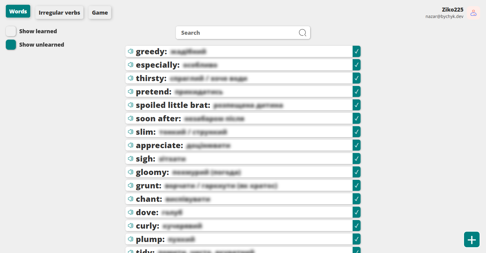
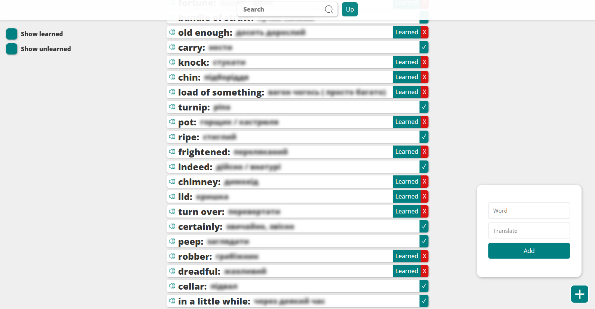
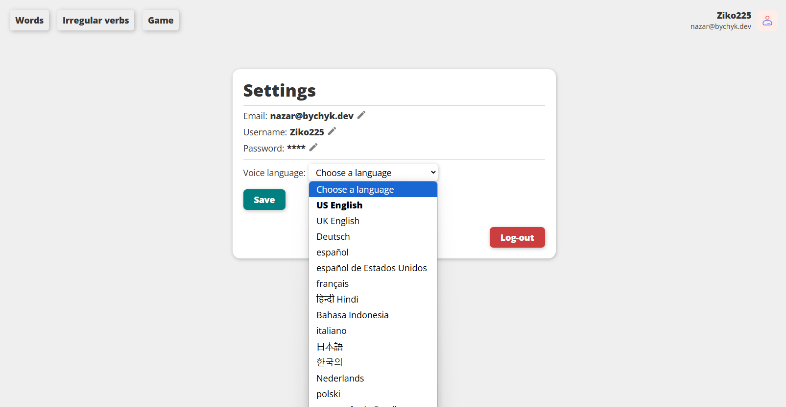
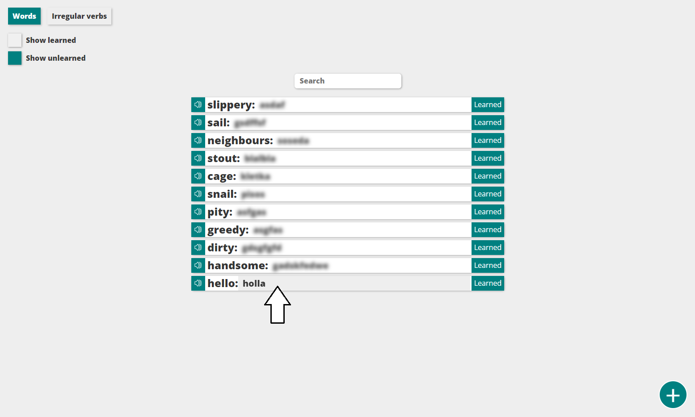
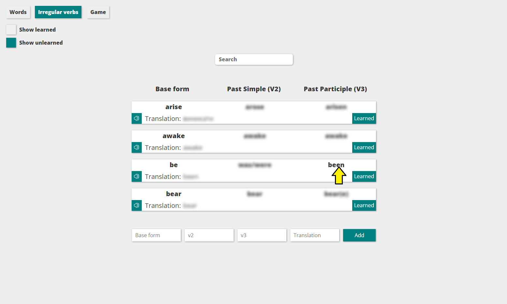
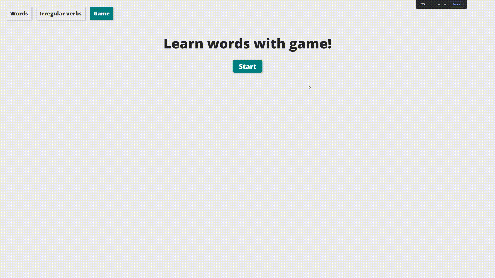
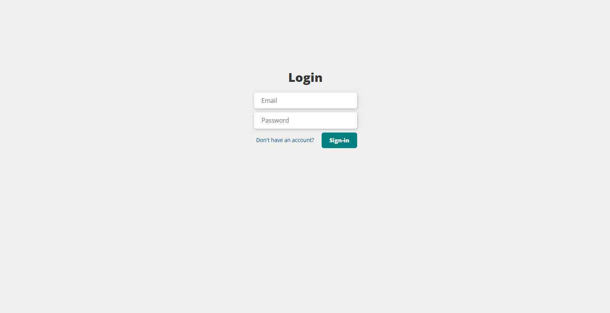

# Dictionary
### This app improves your English language learning experience!
### features:
- Authorization using the JWT token **✓**
- Listen to the pronunciation of words **✓**
- See the translation of words when you click on them **✓**
- Mark words as learning **✓**
- Responsiveness for use with mobile **✓**
- Very easy to set up (uses JSON as a database) **✓**

Include game ✓
* if you enter the correct word, it will be marked as learned.
* if you click "I do not know" button, the word will switch to unlearned.
* Selects a random word from your dictionary.

# Available Scripts:

## **Client:**

### **`npm start`**

Runs the app in the development mode.\
Open [http://localhost:3000](http://localhost:3000) to view it in the browser.

The page will reload if you make edits.\
You will also see any lint errors in the console.

### **`npm run build`**

Builds the app for production to the `build` folder.\
It correctly bundles React in production mode and optimizes the build for the best performance.

The build is minified and the filenames include the hashes.\
Your app is ready to be deployed!

See the section about [deployment](https://facebook.github.io/create-react-app/docs/deployment) for more information.

## **Server:**

### **`npm start`**
Starts NodeJS express server at 5500 (default) port.

### **`npm run dev`**
Runs the server in the development mode at 5500 (default) port.

# Getting Started
(If you're interested in trying out the app without installing it on your computer – just let me know and I’ll provide you with online access.)
* Clone the repository or download manually.

Backend
* Open the server folder `/server`
* Install dependencies there `npm install`
* Create the .env file in the `/server` folder (You can use .local.env as an example)
* (optional) If you need to use the `https` protocol - create `/credentials` folder and add `privateKey.key` and `certificate.crt` files to this folder.
* Run the server `npm start`
  
Frontend
* Open the client folder `/client`
* Install dependencies there `npm install`
* Create the .env file in the `/client` folder (You can use .local.env as an example)
* Run the app `npm start`

# Demo:

## New UI version
### Dictionary (Words):

### Settings:

## Old UI

### Dictionary (Unlearned words):

### Dictionary (Irregular Verbs):

### Game:

### Log in:
