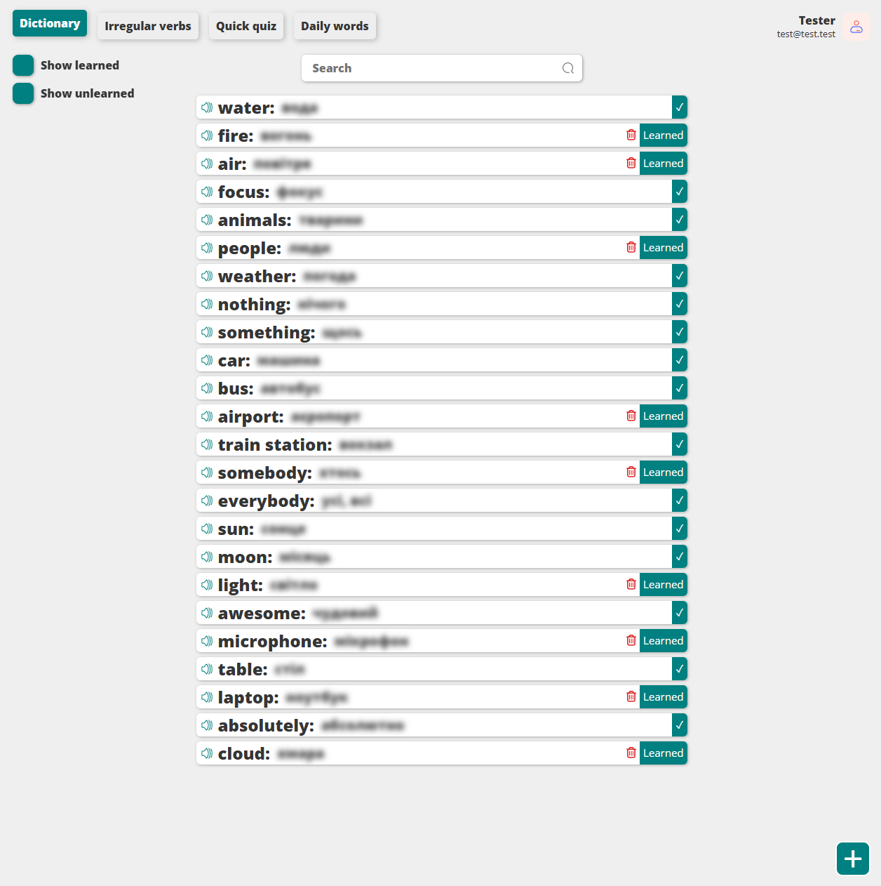

# Dictionary
### This app improves your English language learning experience!
### features:
- Authorization using the JWT token **✓**
- Listen to the pronunciation of words **✓**
- See the translation of words when you click on them **✓**
- Mark words as learning **✓**
- Responsiveness for use with mobile **✓**
- Very easy to set up (uses JSON as a database) **✓**

#### Include game ✓
* if you enter the correct word, it will be marked as learned.
* if you click "I do not know" button, the word will switch to unlearned.
* Selects a random word from your dictionary.

# Available Scripts:

## **Client:**

### **`npm start`**

Runs the app in the development mode.\
Open [http://localhost:3000](http://localhost:3000) to view it in the browser.

The page will reload if you make edits.\
You will also see any lint errors in the console.

### **`npm run build`**

Builds the app for production to the `build` folder.\
It correctly bundles React in production mode and optimizes the build for the best performance.

The build is minified and the filenames include the hashes.\
Your app is ready to be deployed!

See the section about [deployment](https://facebook.github.io/create-react-app/docs/deployment) for more information.

### **`npm run eject`**

**Note: this is a one-way operation. Once you `eject`, you can’t go back!**

If you aren’t satisfied with the build tool and configuration choices, you can `eject` at any time. This command will remove the single build dependency from your project.

Instead, it will copy all the configuration files and the transitive dependencies (webpack, Babel, ESLint, etc) right into your project so you have full control over them. All of the commands except `eject` will still work, but they will point to the copied scripts so you can tweak them. At this point you’re on your own.

You don’t have to ever use `eject`. The curated feature set is suitable for small and middle deployments, and you shouldn’t feel obligated to use this feature. However we understand that this tool wouldn’t be useful if you couldn’t customize it when you are ready for it.

## **Server:**

### **`npm start`**
Starts app at 5500 port.

### **`npm run dev`**
Runs the app in the development mode at 5500 port.

# Demo:

## Dictionary (Learned words):

## Dictionary (Unlearned words):

## Dictionary (Irregular Verbs):

## Game:

## Log in to the app:
